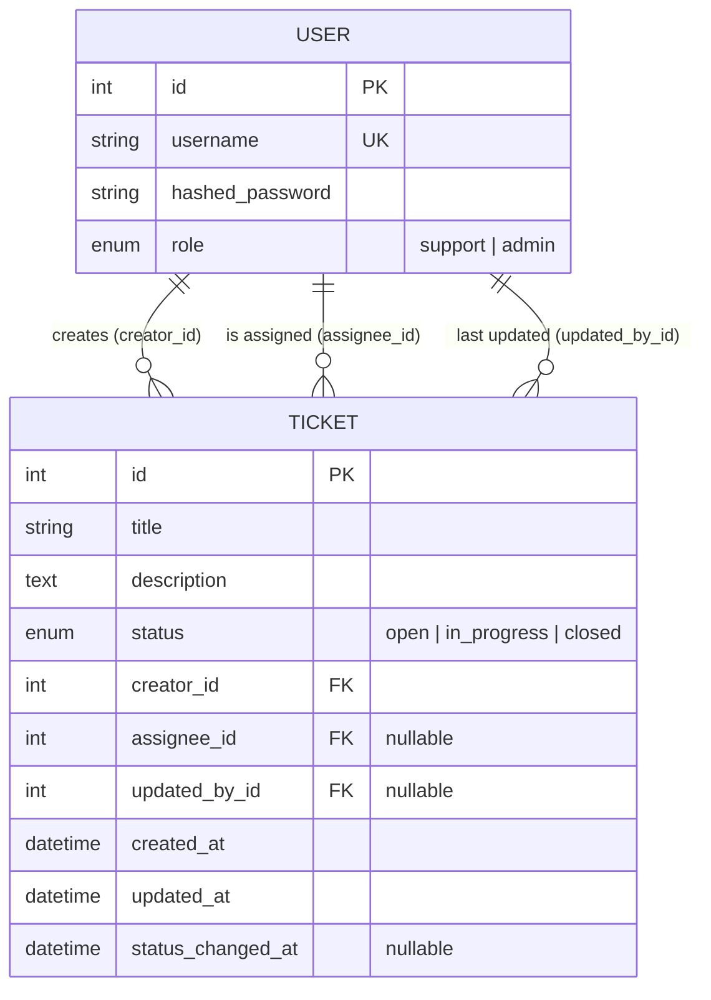

# Deskly — Mini Helpdesk / Ticket Management System

A small role-based helpdesk app with two user types:

- **Support User** — creates and manages their own tickets
- **Admin** — manages all tickets, assignment, and statistics

Built as a technical interview / portfolio project. See [`CLAUDE.md`](./CLAUDE.md) for the full assignment spec and conventions this codebase follows.

## Tech Stack

| Layer    | Technology                     |
|----------|---------------------------------|
| Frontend | React.js *(in progress)*        |
| Backend  | FastAPI (Python)                |
| Database | SQLite                          |
| Auth     | JWT (username/password login)   |
| API      | RESTful, JSON                   |

## Status

- ✅ **Backend** — implemented, tested (24 passing pytest cases), manually smoke-tested end-to-end
- 🚧 **Frontend** — not yet started

## Project Structure

```
backend/
  app/
    main.py          # FastAPI app, CORS, router wiring, startup (create tables)
    core/
      config.py       # env-driven settings (DB URL, JWT secret/alg/expiry, CORS)
      security.py      # password hashing (bcrypt), JWT create/decode
      deps.py           # get_current_user, require_admin FastAPI dependencies
    models/            # SQLAlchemy ORM models (User, Ticket)
    schemas/            # Pydantic request/response schemas
    api/
      auth.py            # POST /auth/login
      tickets.py          # support-user ticket routes (own tickets only)
      admin.py             # admin-only routes (all tickets, assign, stats)
    services/
      ticket_service.py     # ownership checks, status-transition rules, stats
    db/
      base.py                # SQLAlchemy declarative base
      session.py              # engine + session factory + get_db dependency
      seed.py                  # demo admin/support users + sample tickets
  tests/                        # pytest + httpx test suite
  requirements.txt

CLAUDE.md   # assignment spec & engineering conventions
README.md
```

## Backend Architecture

**Layering:** routers (`api/`) are kept thin — they only validate input and shape responses. All business rules (ownership, status transitions, assignment validity, stats aggregation) live in `services/ticket_service.py`, so the same rules apply consistently whether called from a support-user or admin route, and are unit-testable in isolation.

**Auth:** `POST /auth/login` verifies username/password (bcrypt) and issues a JWT (`sub` = username, `role` = user role, expiry from config). Every protected route depends on `get_current_user` (decodes + validates the JWT, loads the user) or `require_admin` (additionally checks `role == admin`, raising `403` otherwise). Role checks live in one place — never repeated per-route.

**Enforcement rules (server-side, not just UI):**
- **Ownership** — a support user can only `GET`/`PUT`/`DELETE` tickets where `creator_id == current_user.id`; anything else is `403`.
- **Status-gated edit/delete** — a support user may update or delete their ticket only while `status == open` (`400` otherwise).
- **Status transitions** — admin-only, one step forward at a time: `open → in_progress → closed`. Skipping or reversing a transition returns `400`.
- **Assignment** — admin-only; `assignee_id` must reference an existing user with role `support`, or `400`.
- **Role boundary** — every `/admin/*` route requires `role == admin`; a support user hitting it gets `403`.

### API Overview

| Method | Endpoint                          | Who            | Purpose                                   |
|--------|------------------------------------|----------------|--------------------------------------------|
| POST   | `/auth/login`                       | anyone         | Login, returns JWT + user                  |
| POST   | `/tickets`                           | authenticated  | Create a ticket                            |
| GET    | `/tickets`                            | authenticated  | List **my** tickets                        |
| GET    | `/tickets/{id}`                        | owner only     | Ticket detail                              |
| PUT    | `/tickets/{id}`                         | owner, open only | Update ticket                            |
| DELETE | `/tickets/{id}`                          | owner, open only | Delete/cancel ticket                     |
| GET    | `/admin/tickets`                          | admin          | List all tickets, `search`, `status`, pagination |
| GET    | `/admin/tickets/{id}`                      | admin          | Ticket detail (any ticket)                 |
| PATCH  | `/admin/tickets/{id}/status`                | admin          | Change status (validated transition)       |
| PATCH  | `/admin/tickets/{id}/assign`                 | admin          | Assign to a support user                   |
| DELETE | `/admin/tickets/{id}`                         | admin          | Delete a ticket                            |
| GET    | `/admin/stats`                                 | admin          | Dashboard counts (total/open/in-progress/closed, by assignee) |
| GET    | `/admin/support-users`                          | admin          | List support users (for assignment dropdown) |

## Entity Relationship Diagram



## Getting Started (Backend)

```bash
cd backend
python3 -m venv venv
source venv/bin/activate
pip install -r requirements.txt

# create demo data: admin/admin123, alice/alice123, bob/bob123 (support)
python -m app.db.seed

# run the API
uvicorn app.main:app --reload
```

API docs available at `http://127.0.0.1:8000/docs` once running.

Run the test suite:

```bash
cd backend
pytest -q
```

## Frontend

Not yet implemented. Planned structure and pages are documented in [`CLAUDE.md`](./CLAUDE.md#suggested-architecture).

## Assumptions & Limitations

- No user self-registration endpoint — accounts are provisioned via the seed script (matches the assignment's username/password-only auth scope; a registration flow was out of scope).
- JWTs are long-lived (24h by default) with no refresh-token flow yet.
- SQLite is used intentionally so the project runs with zero external setup.
